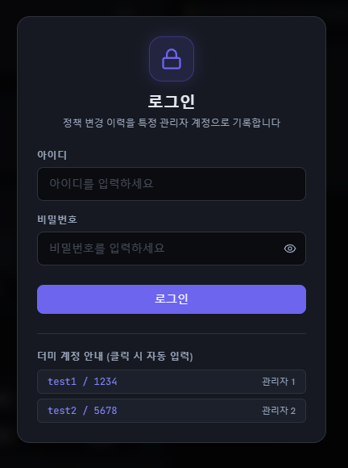
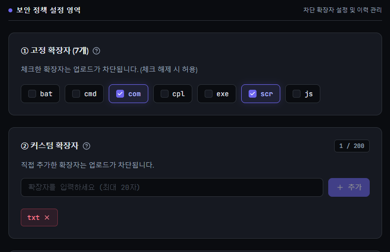
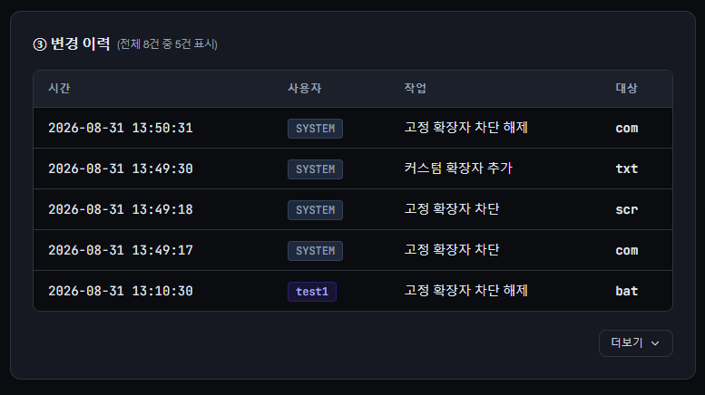
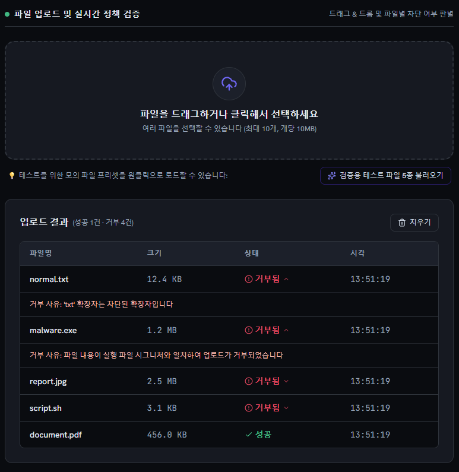
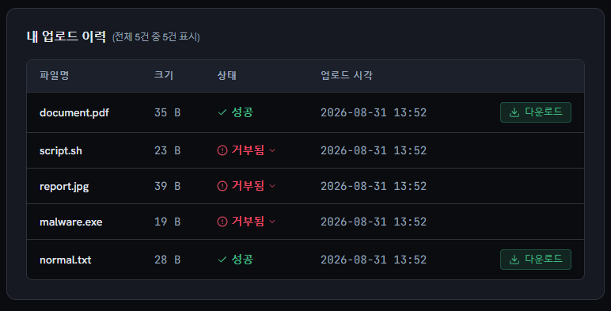
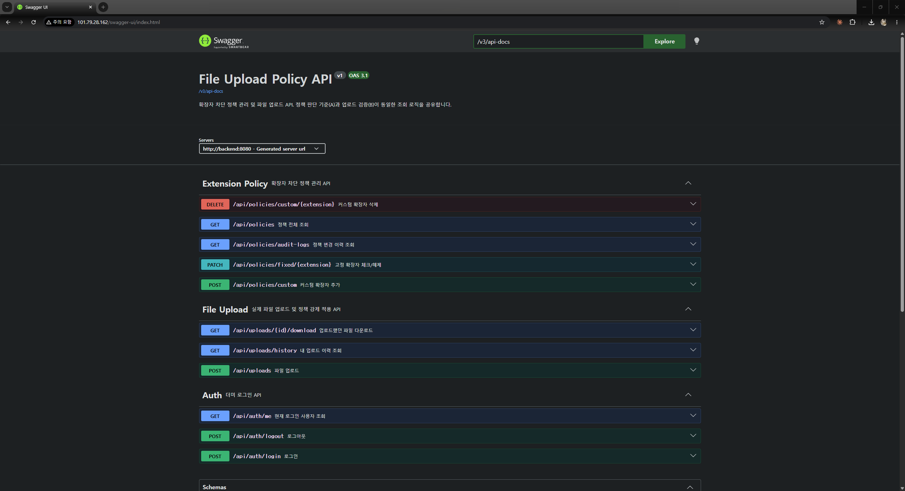
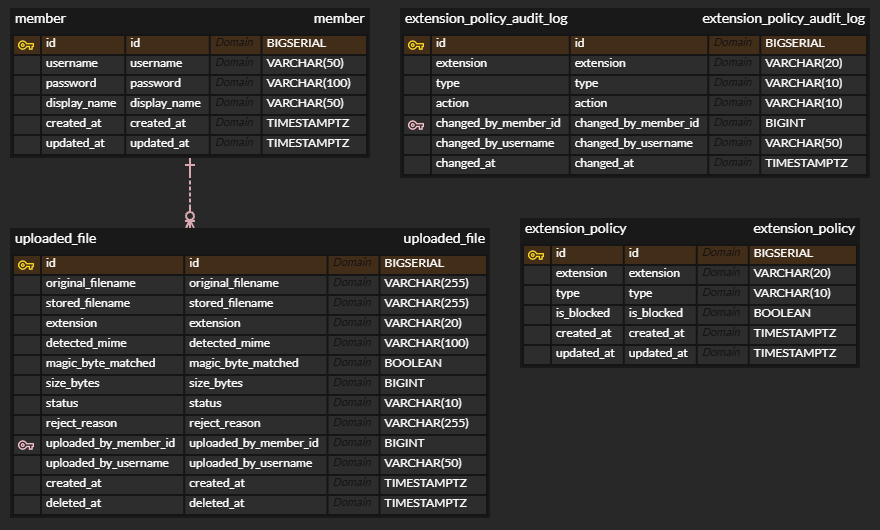
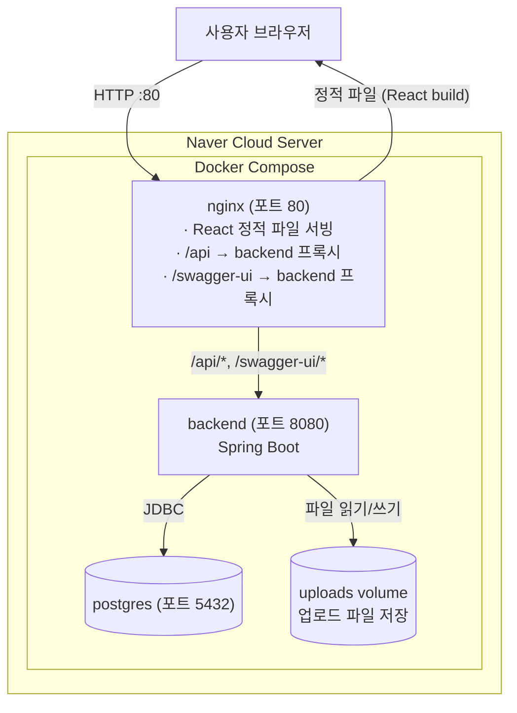

# File Upload Policy Manager

파일 확장자 차단 정책을 관리하고, 그 정책이 실제 파일 업로드에 즉시 반영되는 것까지
검증할 수 있는 보안 관리 콘솔입니다.

> 정책만 있고 실제로 막지 못하는 화면이 아니라, 정책 화면(A)과 실제 업로드 검증(B)이
동일한 판단 기준을 공유하도록 설계했습니다.
> 

---

## 목차

- [바로가기](#-바로가기)
- [프로젝트 산출물](#-프로젝트-산출물)
- [주요 기능](#-주요-기능)
- [시스템 아키텍처](#-시스템-아키텍처)
- [기술 스택](#-기술-스택)
- [프로젝트 구조](#-프로젝트-구조)
- [실행 방법](#-실행-방법)
- [데이터베이스 스키마](#-데이터베이스-스키마)
- [API 문서](#-api-문서)
- [관련 문서](#-관련-문서)

---

## 🔗 바로가기

| 항목 | 링크 |
| --- | --- |
| **배포된 사이트** | http://101.79.28.162/ |
| **API 문서 (Swagger)** | http://101.79.28.162/swagger-ui/index.html |
| **GitHub 저장소** | https://github.com/say-hiseo/file-upload-policy |
| 요구사항 정의서 | [`REQUIREMENTS.md`](./REQUIREMENTS.md) |
| 기획/보안/예외/운영 고려사항 | [`CONSIDERATIONS.md`](./CONSIDERATIONS.md) |
| DB 스키마 상세 설계 (ERD 포함) | [`SCHEMA_DESIGN.md`](./SCHEMA_DESIGN.md) |
| AI 활용 기록 | [`PROMPT_LOG.md`](./PROMPT_LOG.md) |

### 데모 계정 (더미 로그인)

> 실서비스라면 계정 정보를 화면에 노출하지 않는 게 원칙이지만, 이 프로젝트는 심사
목적상 누구나 바로 로그인해서 검증할 수 있도록 의도적으로 안내합니다.
> 

| 아이디 | 비밀번호 |
| --- | --- |
| test1 | 1234 |
| test2 | 5678 |

로그인 없이도 정책 조회/변경, 파일 업로드는 전부 이용 가능합니다 (변경 이력에 `SYSTEM`으로 기록됨).

---

## 📸 프로젝트 산출물

### 1. 로그인 화면
더미 계정으로 로그인하는 화면입니다. 심사자가 바로 로그인해볼 수 있도록 계정
정보를 화면에 안내합니다.



### 2. 정책 관리 화면 — 고정/커스텀 확장자
고정 확장자 체크 상태와 커스텀 확장자 목록(`n/200`)을 함께 관리하는 화면입니다.
정책이 실제로 설정 가능함을 보여줍니다.



### 3. 정책 변경 이력
`changed_by_username`에 실제 로그인 계정(test1 등)과 `SYSTEM`이 함께 기록되어,
로그인 여부에 따른 감사 로그 차이를 보여줍니다.



### 4. 파일 업로드 — 성공/거부 결과
이 프로젝트의 핵심 증명 지점입니다. 정상 파일은 성공 처리되고, 차단 확장자
파일과 확장자를 위장한 파일(매직바이트 불일치) 모두 구체적인 사유와 함께 거부됩니다.



### 5. 내 업로드 이력 (로그인 상태)
로그인 후 과거 업로드 이력을 조회하고, 성공한 파일은 다시 다운로드할 수 있습니다.



### 6. Swagger API 문서
전체 엔드포인트가 태그(Auth, Extension Policy, File Upload)별로 정리되어 있습니다.



### 7. ERD
테이블 간 관계도입니다. 상세 스키마는 [`SCHEMA_DESIGN.md`](./SCHEMA_DESIGN.md)를 참고해 주세요.



---

## ✨ 주요 기능
### A. 확장자 차단 정책 관리

- 고정 확장자 7종(`bat`, `cmd`, `com`, `cpl`, `exe`, `scr`, `js`) 체크/해제
- 커스텀 확장자 등록(최대 20자, 최대 200개)/삭제, 중복 및 고정 확장자와의
충돌 방지
- 모든 변경 사항은 DB에 저장되어 새로고침해도 유지
- 정책 변경 이력(누가/언제/무엇을) 조회

### B. 실제 파일 업로드 처리

- A에서 설정한 정책이 실제 업로드에 그대로 강제 적용 (같은 조회 로직 공유)
- 확장자 검증 + 매직바이트(파일 시그니처) 검증의 2단계 방어
    - 이중 확장자 우회(`file.exe.txt`) 방지
    - 확장자 위장(`report.jpg`인데 실제 내용은 실행 파일) 탐지
- 거부 시 무엇이 왜 막혔는지 구체적 사유 반환
- 요청당 최대 10개 파일, 파일당 최대 10MB, 부분 성공(파일별 개별 결과) 지원
- 로그인 사용자는 본인의 업로드 이력 조회 및 재다운로드 가능

---

## 🏗 시스템 아키텍처



**요청 흐름 요약**

```
1. 사용자가 http://<서버IP>/ 접속
   → nginx가 React 정적 빌드 파일을 그대로 서빙

2. 프론트가 /api/... 로 요청
   → nginx가 이를 backend 컨테이너(8080)로 프록시
   → 개발 환경에서는 Vite dev server의 proxy 설정이 동일한 역할을 함
     (프론트 코드는 항상 상대경로 /api/...만 사용하므로 개발/배포 환경
      전환 시 코드 변경이 필요 없음)

3. backend는 세션 쿠키(더미 로그인)로 요청자를 식별하고,
   postgres에서 정책/이력을 조회·저장, uploads 볼륨에 실제 파일을 저장

4. postgres, uploads 볼륨 모두 Docker Volume으로 호스트에 마운트되어
   컨테이너 재시작/재배포 시에도 데이터가 유지됨
```

**컨테이너 간 통신은 Docker Compose가 자동 생성하는 내부 네트워크를 통해
서비스명(`backend`, `postgres`)으로 이루어지며, 외부에는 nginx(80)만
노출됩니다** (backend의 8080은 개발 편의를 위해 현재 함께 열어두었으나,
운영 환경이라면 내부 통신만 허용하고 닫는 것이 권장됩니다 — `CONSIDERATIONS.md`
4-5 참고).

---

## 🛠 기술 스택

| 영역 | 기술 |
| --- | --- |
| Backend | Java 17, Spring Boot 4.1.1, Spring Data JPA, Flyway, springdoc-openapi(Swagger) |
| Frontend | React, TypeScript, Vite, Tailwind CSS |
| Database | PostgreSQL 16 |
| Infra | Docker, Docker Compose, nginx, Naver Cloud Platform(Server) |
| 빌드 도구 | Gradle(Groovy DSL), npm |

---

## 📁 프로젝트 구조

```
file-upload-policy/
├── docker-compose.yml          # postgres + backend + frontend(nginx) 오케스트레이션
├── .gitignore
├── README.md
├── CONSIDERATIONS.md           # 기획/보안/예외/운영 고려사항
├── SCHEMA_DESIGN.md            # DB 스키마 상세 설계 및 설계 과정
├── PROMPT_LOG.md               # AI 활용 기록
│
├── backend/
│   ├── build.gradle
│   ├── settings.gradle
│   ├── Dockerfile
│   └── src/main/
│       ├── java/com/assignment/fileuploadpolicy/
│       │   ├── domain/
│       │   │   ├── member/       # 더미 로그인
│       │   │   ├── policy/       # A. 확장자 차단 정책 관리
│       │   │   └── upload/       # B. 파일 업로드 + 이력/다운로드
│       │   └── global/
│       │       ├── auth/         # 세션 기반 ActorContext
│       │       ├── config/       # OpenAPI, 설정 프로퍼티
│       │       └── exception/    # 공통 에러 처리 (ErrorCode, BusinessException)
│       └── resources/
│           ├── application.yml
│           ├── application-local.yml
│           └── db/migration/     # Flyway 마이그레이션 (V1__init_schema.sql)
│
└── frontend/
    ├── Dockerfile
    ├── nginx.conf
    ├── package.json
    ├── vite.config.ts
    └── src/
        ├── api/                 # 백엔드 API 호출 (도메인별)
        ├── types/               # 백엔드 DTO와 대응하는 타입 정의
        ├── features/            # 도메인별 화면 (policy, upload, auth)
        └── components/          # 공용 컴포넌트
```

---

## 🚀 실행 방법

### 사전 요구사항

- Docker Desktop (또는 Docker + Docker Compose)
- (전체 컨테이너 실행만 할 경우 별도 설치 불필요 — JDK/Node는 Docker 이미지
안에서 빌드되므로 로컬에 없어도 됩니다)

### 방법 1) 전체 컨테이너로 한 번에 실행 (권장)

```bash
git clone https://github.com/say-hiseo/file-upload-policy.git
cd file-upload-policy
docker compose up -d --build
```

빌드 완료 후 브라우저에서 `http://localhost/` 접속.

확인:

```bash
docker compose ps   # postgres(healthy), backend, frontend 모두 Up 상태여야 함
```

### 방법 2) 로컬 개발 모드 (백엔드/프론트를 각각 직접 실행)

**DB만 컨테이너로 실행**

```bash
docker compose up -d postgres
```

**백엔드 실행**

```bash
cd backend
./gradlew bootRun --args='--spring.profiles.active=local'
```

→ `http://localhost:8080/swagger-ui/index.html`에서 API 확인 가능

**프론트엔드 실행** (별도 터미널)

```bash
cd frontend
npm install
npm run dev
```

→ Vite dev server가 `/api` 요청을 `localhost:8080`으로 프록시하도록
`vite.config.ts`에 설정되어 있습니다.

### 테스트 실행

```bash
cd backend
./gradlew test
```

확장자 정규화 로직(`ExtensionNormalizer`)에 대한 단위 테스트 32건이 포함되어
있습니다 (대소문자, 이중 확장자, 공백, 특수문자, null byte, RTLO 등 우회 패턴
검증).

---

## 🗄 데이터베이스 스키마

전체 DDL과 설계 과정(왜 이런 구조를 택했는지)은 `SCHEMA_DESIGN.md`를
참고해 주세요. 아래는 테이블 요약입니다.

| 테이블 | 설명 |
| --- | --- |
| `member` | 더미 로그인용 사용자 |
| `extension_policy` | 확장자 차단 정책 (고정 7종 + 커스텀, `type` 컬럼으로 구분) |
| `extension_policy_audit_log` | 정책 변경 이력 (불변 로그) |
| `uploaded_file` | 업로드 처리 결과 (성공/거부, 매직바이트 검증 결과 포함) |

### 핵심 설계 포인트

- `extension_policy.extension`에 **전역 UNIQUE 제약**을 걸어, 고정/커스텀
확장자 간 겹침을 DB 레벨에서 구조적으로 방지
- 감사 로그(`extension_policy_audit_log`, `uploaded_file`)는 참조 대상이
삭제되어도 기록이 보존되도록 **FK(`ON DELETE SET NULL`) + 스냅샷 컬럼**을
함께 사용
- `created_at`/`updated_at`/`deleted_at`은 "상태가 반복적으로 바뀌는지"와
"불변 로그인지"를 기준으로 테이블마다 다르게 적용 (상세 근거는
`SCHEMA_DESIGN.md` 참고)

*(ERD는 `SCHEMA_DESIGN.md`에 Mermaid 다이어그램으로도 포함되어 있어 GitHub에서
바로 렌더링됩니다. 실제 캡처본은 위 "프로젝트 산출물" 섹션의 `07-erd.png`를 참고해 주세요.)*

---

## 📄 API 문서

전체 엔드포인트는 Swagger UI에서 직접 확인/호출 가능합니다.

```
로컬:   http://localhost:8080/swagger-ui/index.html
배포:   http://101.79.28.162/swagger-ui/index.html
```

주요 엔드포인트 그룹:

```
/api/auth/*      로그인/로그아웃/현재 사용자 조회
/api/policies/*  확장자 정책 조회/변경/이력
/api/uploads/*   파일 업로드/이력 조회/다운로드
```

---

## 📚 관련 문서

| 문서 | 내용 |
|---|---|
| [`REQUIREMENTS.md`](./REQUIREMENTS.md) | 요구사항 정의서 (동작/제약 중심) |
| [`CONSIDERATIONS.md`](./CONSIDERATIONS.md) | 기획/검증·보안/정책·데이터/UX·예외/운영 관점 판단과 근거 |
| [`SCHEMA_DESIGN.md`](./SCHEMA_DESIGN.md) | 테이블 스키마 DDL, ERD 및 설계 과정 |
| [`PROMPT_LOG.md`](./PROMPT_LOG.md) | AI 활용 프롬프트 기록, 스킬/도구 사용 내역, 판단 근거 회고 |
